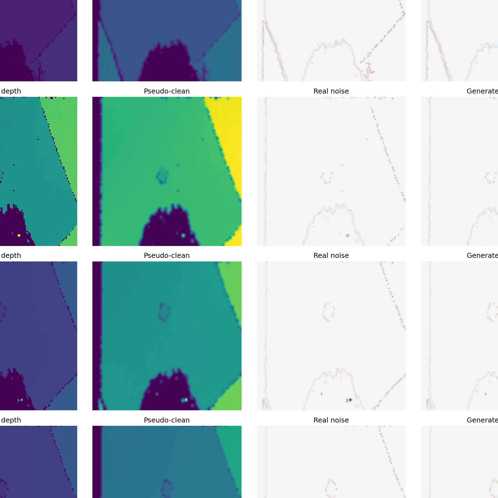
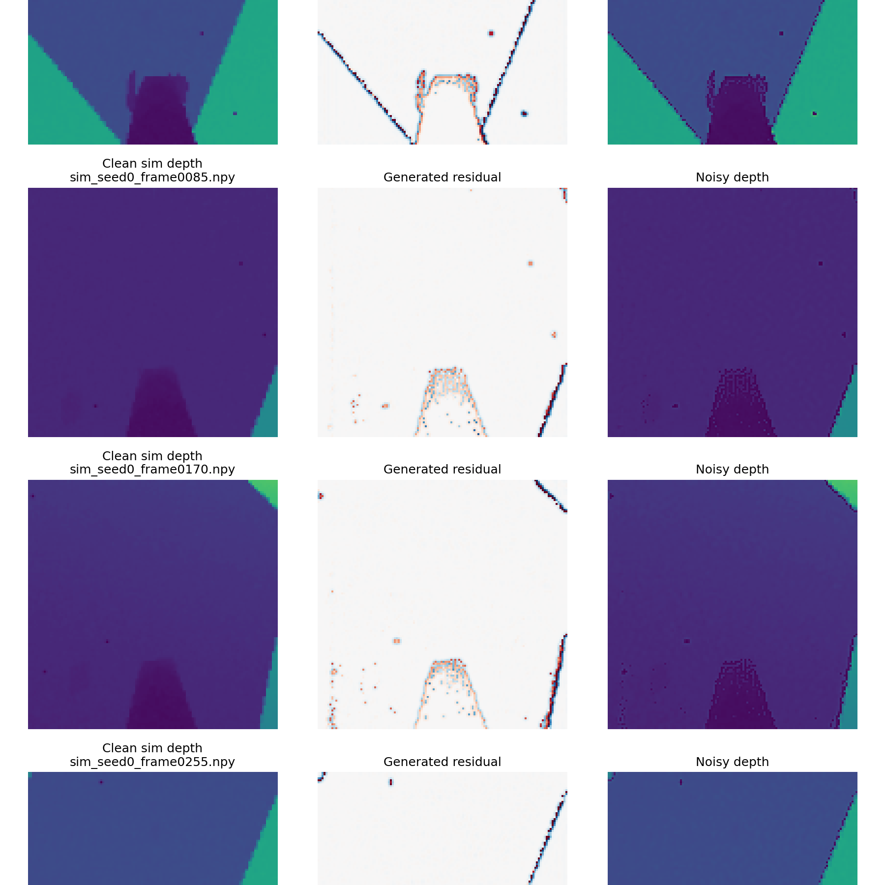

# Depth Noise Diffusion

[English](./readme.md) | [简体中文](./readme.zh-CN.md)

| Real depth inference | Sim depth inference (as `clean_depth`) |
| :--: | :--: |
|  |  |

- Real depth inference: use real depth `.npy`, build `pseudo_clean` with Gaussian filtering, then compare generated residual noise with the real residual.
- Sim depth inference: extract 4 frames from `sim_seed0.mp4`, convert them to `128x128 uint16` depth `.npy`, and use them directly as the `clean_depth` condition.

This project implements a conditional Denoising Diffusion Probabilistic Model (DDPM) for generating depth camera noise, with a full training and sampling pipeline for sim-to-real depth noise simulation.

## Features

- Lightweight conditional UNet + DDPM
- Residual noise modeling (`raw - pseudo_clean`)
- Supports larger effective batch size via gradient accumulation
- Optional mixed precision training (`--mixed_precision`)
- Auto checkpointing and config export (`config.json`)
- Sampling and visualization with noise statistics

## Files

- `model.py` - Lightweight conditional UNet + DDPM implementation
- `dataset.py` - Depth noise dataset preprocessing and augmentation
- `train_v2.py` - Main training script (recommended)
- `train_v1.py` - Legacy training script (kept for compatibility)
- `sample.py` - Inference and visualization script
- `assets/` - README images and inference result examples
- `requirements.txt` - Python dependencies

## Installation

```bash
pip install -r requirements.txt
```

## Usage

### Training (main: `train_v2.py`)

```bash
python -m depth_noise_diffusion.train_v2 \
    --data_dirs path/to/depth_data1 path/to/depth_data2 \
    --epochs 800 \
    --batch_size 64 \
    --lr 2e-4 \
    --save_dir runs/depth_noise_v2
```

Optional (memory/perf tuning):

```bash
python -m depth_noise_diffusion.train_v2 \
    --data_dirs path/to/depth_data \
    --batch_size 32 \
    --grad_accumulate_steps 2 \
    --mixed_precision
```

### Inference / Visualization

```bash
python -m depth_noise_diffusion.sample \
    --checkpoint runs/depth_noise_v2/best.pt \
    --data_dirs path/to/test_data \
    --n_samples 4 \
    --out_dir runs/depth_noise_v2/vis
```

## Data Format

- Input: `uint16` `.npy` depth images
- Normalization: divide by `65535.0` to `[0, 1]`
- Pseudo-clean target: Gaussian filter (`sigma=0.8`)
- Noise target: residual between raw depth and pseudo-clean depth

## Notes

- `train_v2.py` is the default and actively used training script.
- `train_v1.py` is an older baseline version retained for reference.

## License

This project is released under the [MIT License](../LICENSE).
